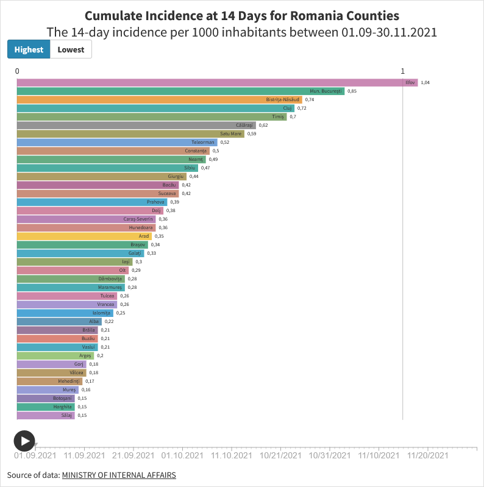

# COVID-19 Interactive Flourish Story Board

An interactive Flourish story board visualizing COVID-19 trends. The project highlights infection rates, recoveries, and key metrics across regions using animated charts like line graphs, bar charts, pie charts, and bar chart races. It enables intuitive exploration of pandemic dynamics.

## Key Features

- Interactive and animated visualizations
- Multi-chart storytelling for clear insights
- Highlights trends and regional comparisons
- Designed for easy exploration and understanding

## Technology

- **Flourish** for interactive charts
- Data sources: 

https://www.kaggle.com/datasets/imdevskp/corona-virus-report - as published in 2020
https://ourworldindata.org/ - as published in 2022
https://www.mai.gov.ro/ - as published in Press Release in 2021

## Repository Structure

```
COVID-19-Interactive-Story/
│
├─ README.md             # Project description
├─ screenshots/          # Images of the story
│   ├─ screenshot1.png
│   └─ screenshot2.png
├─ data/                 # datasets used

## Screenshots




## Live Version

Explore the dashboard online: https://public.flourish.studio/story/3412652/ 
